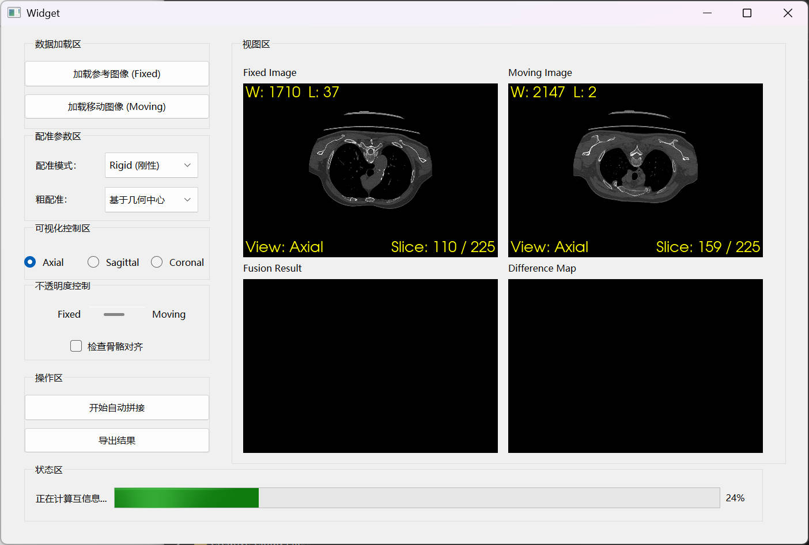

# DicomStitcher

基于 Qt / VTK / ITK 的双视图 DICOM 查看与后续拼接实验项目。

## 技术栈
- Qt 5.15 (Widgets, AUTOUIC/AUTOMOC)
- VTK 9.2 (RenderingOpenGL2, ResliceImageViewer)
- ITK 5.3 (GDCM 序列读取)
- CMake ≥ 3.16，MSVC 2019，Windows 10/11

## 构建
1) 安装依赖并在 CMake 中设置  
   - `VTK_DIR`: `C:/Program Files/VTK/lib/cmake/vtk-9.2`  
   - `ITK_DIR`: `C:/Program Files/ITK/lib/cmake/ITK-5.3`
2) 用 Qt Creator 打开 `CMakeLists.txt`，选择 MSVC + Qt 5.15 kit，配置并构建。

## 运行与交互
- Fixed：`btn_load_fixed` 选择目录加载；Moving：`btn_load_moving` 加载。两者互不影响。
- 单选框切换 Axial / Coronal / Sagittal，同步两视图方向与各自切片。
- 窗宽/窗位与切片：使用 VTK 默认交互（滚轮切片，右键拖动或 Shift+左键调窗宽窗位）。
- 未显示患者姓名/ID，避免中文编码引发问题。

## 项目结构
```
DicomStitcher/
├── CMakeLists.txt
├── main.cpp
├── widget.h / widget.cpp / widget.ui
├── imgs/
└── README.md
```

## 规划中的处理与配准流程（任务清单）
- 预处理  
  - [ ] 方向标准化（任意 LPS/RAI/LPI → RAS）  
  - [ ] 体素间距统一（如 1×1×1 mm³）
- 粗定位  
  - [ ] 基于身体轮廓（皮肤）的粗配准  
  - [ ] 基于骨骼的粗配准（优先）
- 精定位 ROI  
  - [ ] 提取真实重叠区域（腰部/躯干交汇区）
- 精配准（多分辨率 4→2→1 + MI/NMI）  
  - [ ] Rigid（6 DoF）  
  - [ ] Affine（12 DoF）  
  - [ ] 可选 B-spline 非刚性
- 统一世界坐标  
  - [ ] 变换矩阵 T 作用于 Moving 全体积，Fix 保持原坐标
- 输出体素空间  
  - [ ] 定义统一输出尺寸与间距，Resample 双图到全局输出空间
- 融合/拼接  
  - [ ] 非重叠区直接填充 warp 后体素  
  - [ ] 重叠区线性加权融合（距离加权）
- 后处理  
  - [ ] 灰度匹配（Histogram Matching）  
  - [ ] 重采样/平滑边界  
  - [ ] 可选伪影抑制或对比度增强

